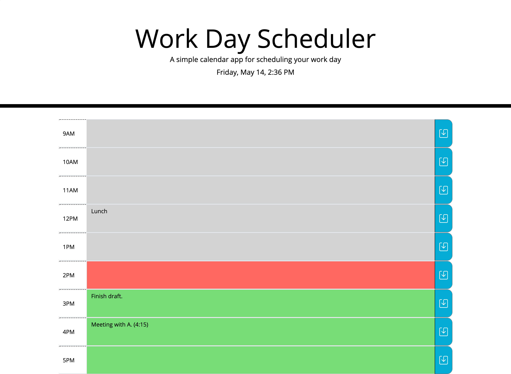

# Work Day Scheduler

## Description

This is a work scheduler application — built in order to provide users with a way to plan out the tasks that they need to complete each day. It allows users to input personalized "to-do's" for each hour of the workday (9-5) and save those to LocalStorage for reviewing later. It also keeps track of the local time in order to color-code hours to signify to the user whether deadlines have passed, are soon coming up, or are in the future still. 

## Installation

This scheduler application has been deployed to a GitHub Pages site (accessible [here](https://msteblu.github.io/Scheduler_APIs/)), where users can interact with it, planning out their tasks for each hour of the workday and saving them to LocalStorage. 

All of the components of the application are also available through a download and clone. 

## Usage

Navigate either to the [GitHub site](https://msteblu.github.io/Scheduler_APIs/) or open the index.html file in a browser. Plan out your day by checking the date/time at the top of the page, inputing notes for various hours of the day, and saving those notes to your local storage. 

*Example of Usage:*

## Credits

Starter code provided by the University of Minnesota Coding Bootcamp.

## License

Licensed under the [MIT](https://github.com/microsoft/vscode/blob/main/LICENSE.txt) license. 
___